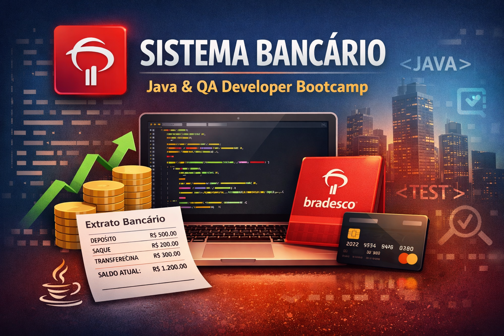

# 🏦 Sistema Bancário - Projeto de QA
> Bootcamp Tech Bradesco | DIO (Java & QA Developer) 



## 🚀 Descrição do Projeto
Este repositório apresenta um projeto de portfólio em **Quality Assurance (QA)** baseado em um sistema bancário fictício inspirado no Banco Bradesco, como conclusão do Desafio de Projeto do bootcamp. 

> ⚠️ **Observação:** Este é um projeto fictício com fins educacionais e de portfólio. Não possui vínculo com o Banco Bradesco real.

## 🎯 Objetivo
Demonstrar a criação de artefatos de QA, incluindo documentação, User Stories, casos de teste, mind-map e definição de processos de desenvolvimento e ciclo de vida de bugs.

## 🧠 Conceitos Aplicados
- Análise de Requisitos
- Criação de User Stories
- Planejamento de Testes
- Elaboração de Casos de Teste (Step-by-Step e BDD)
- Modelagem de Mind-map
- Definição de Workflow de Desenvolvimento
- Gestão de Bugs
- Uso de ferramentas como **JIRA** e **Confluence**

## 🏦 Sobre o Sistema
O sistema simula funcionalidades essenciais de um aplicativo bancário digital, permitindo que clientes realizem operações financeiras de forma segura, como:
- Login✅
- Consulta de saldo e extrato✅
- Transferências (entre contas do mesmo banco)✅
- Pagamento de contas✅
- Gerenciamento de dados do usuário✅

### 📌 Implementações Futuras
- Abertura de conta❌
- Investimentos❌
- Empréstimos❌
- Cartões de crédito❌
- PIX avançado❌
- Biometria❌
- Integrações reais❌

## 🧪 Artefatos de QA
Neste repositório você encontrará:

- 📄 Plano de fluxo de trabalho e ciclo de vida do bug
- 📄 Documento com User Stories
- 🗺️ Mind-map de User Story
- ✅ Casos de teste Step-by-Step
- 🧩 Casos de teste em BDD (Gherkin)
- 🐞 Exemplos de bugs simulados no JIRA

## 🛠️ Tecnologias Utilizadas
| Tecnologia        | Descrição        |  
|--------------------|---------------------|  
| JIRA         | Gerenciamento de User Stories, tarefas e bugs     | 
| Confluence         | Documentação e base de conhecimento do projeto      |
| Git e GitHub         | Versionamento e organização dos artefatos      |    

## 📂 Estrutura do Projeto

```text
sistema-bancario-qa/
├── docs/
│   ├── workflow-e-buglife/
│   ├── user-stories/
│   └── evidencias/
├── testes/
│   ├── mindmap/
│   ├── casos-step-by-step/
│   ├── casos-bdd/
│   └── massa-de-teste/
├── jira/
├── confluence/
└── README.md
```

## 📝 Licença
This project is licensed under the MIT License. See the LICENSE file for details.

## 💬 Conecte-se comigo
Acompanhe minha jornada e outros projetos em:
- **E-mail:** [lucsantosdev@gmail.com](mailto:lucsantosdev@gmail.com)
- **LinkedIn:** [lucsantosdev](https://www.linkedin.com/in/lucsantosdev)
- **GitHub:** [lucsantosdev](https://github.com/lucsantosdev)

---

🧠 Je 9:23-24